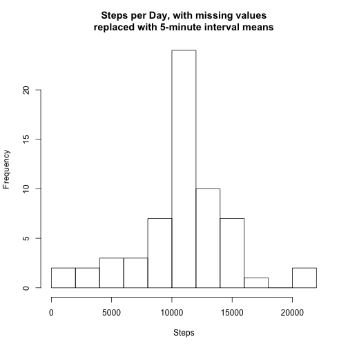

PA1_template
========================================================
# Reproducible Research Peer Assessment 1

Download, unzip and read in the source data.


```r
#unzip("./activity.zip")

activity <- read.csv("./activity.csv", stringsAsFactors=FALSE)
```

Clean the data into suitable formats for analysis.  


```r
# get a summary
summary(activity)
```

```
##      steps            date              interval     
##  Min.   :  0.00   Length:17568       Min.   :   0.0  
##  1st Qu.:  0.00   Class :character   1st Qu.: 588.8  
##  Median :  0.00   Mode  :character   Median :1177.5  
##  Mean   : 37.38                      Mean   :1177.5  
##  3rd Qu.: 12.00                      3rd Qu.:1766.2  
##  Max.   :806.00                      Max.   :2355.0  
##  NA's   :2304
```

```r
# change from character to date class
activity$date <- as.Date(activity$date, "%Y-%m-%d")
```

## What is mean total number of steps taken per day?
For this part of the assignment, you can ignore the missing values in the dataset.  
- Make a histogram of the total number of steps taken each day


```r
# aggregate the steps by day
steps_per_day <- aggregate(activity$steps ~ activity$date, FUN=sum)

# change column names for ease of reference
colnames(steps_per_day) <- c("date", "steps")

# make the histogram
hist(steps_per_day$steps, xlab="Steps", main="Steps per Day", breaks=10)
```

 

- Calculate and report the mean and median total number of steps taken per day  

```r
# calculate and round the mean
step_mean <- round(mean(steps_per_day$steps))

# calculate the median
step_median <- median(steps_per_day$steps)

# print the results
print(paste("The mean is",step_mean,"and the median is",step_median))
```

```
## [1] "The mean is 10766 and the median is 10765"
```

## What is the average daily activity pattern?

- Make a time series plot (i.e. type = "l") of the 5-minute interval (x-axis) and the average number of steps taken, averaged across all days (y-axis)


```r
# remove NAs
activity_nona <- activity[!is.na(activity$steps),]

# find the sum of each interval (could not get FUN=mean to work)
step_interval_mean <- aggregate(steps~interval, data=activity_nona, FUN=sum)

# find the length of each interval
step_interval_length <- aggregate(steps~interval, data=activity_nona, FUN=length)

# divide the interval sum by the length to find the mean
step_interval_mean$steps <- step_interval_mean$steps/step_interval_length$steps 

# make the plot
plot(step_interval_mean$interval, step_interval_mean$steps, type="l", main="Average Number of Steps Taken per Interval", xlab="Interval", ylab="Steps")
```

 

- Which 5-minute interval, on average across all the days in the dataset, contains the maximum number of steps?


```r
# find the interval with the most steps
maximum <- step_interval_mean[step_interval_mean$steps == max(step_interval_mean$steps),]

# print the results
print(paste("The interval with the most steps, on average, is",maximum$interval))
```

```
## [1] "The interval with the most steps, on average, is 835"
```

## Imputing missing values

Note that there are a number of days/intervals where there are missing values (coded as NA). The presence of missing days may introduce bias into some calculations or summaries of the data.

- Calculate and report the total number of missing values in the dataset (i.e. the total number of rows with NAs)


```r
# find and count up all the NAs
empty <- length(which(is.na(activity)))

# print the results
print(paste("There are", empty, "rows with missing values."))
```

```
## [1] "There are 2304 rows with missing values."
```

- Devise a strategy for filling in all of the missing values in the dataset. The strategy does not need to be sophisticated. For example, you could use the mean/median for that day, or the mean for that 5-minute interval, etc.


```r
# for each row
# if steps is equal to NA
# set NA equal to the 5-minute interval mean
```

- Create a new dataset that is equal to the original dataset but with the missing data filled in.


```r
# copy the data frame
activity_filled_in <- activity

# loop over each row
for (i in 1:length(activity_filled_in$steps)) {
    
    # if the steps value is NA
    if(is.na(activity_filled_in$steps[i])) {
        
        # then fill it in with the 5-minute interval mean
        activity_filled_in$steps[i] <- step_interval_mean[activity_filled_in$interval[i]==step_interval_mean$interval,2]   
    
    }
    
}

# check if all NAs were filled
print(paste("There are now",length(which(is.na(activity_filled_in))), "missing values."))
```

```
## [1] "There are now 0 missing values."
```

- Make a histogram of the total number of steps taken each day and Calculate and report the mean and median total number of steps taken per day. Do these values differ from the estimates from the first part of the assignment? What is the impact of imputing missing data on the estimates of the total daily number of steps?


```r
# aggregate number of steps per day
steps_per_day_filled_in <- aggregate(activity_filled_in$steps ~ activity_filled_in$date, FUN=sum)

# change column names for ease of reference
colnames(steps_per_day_filled_in) <- c("date", "steps")

# find and round the mean
step_mean_filled_in <- round(mean(steps_per_day_filled_in$steps))

# find and round the median
step_median_filled_in <- round(median(steps_per_day_filled_in$steps))

# print the results
print(paste("The mean is",step_mean_filled_in,"and the median is",step_median_filled_in,"when missing values were replaced with 5-minute interval means."))
```

```
## [1] "The mean is 10766 and the median is 10766 when missing values were replaced with 5-minute interval means."
```

```r
# make the plot
hist(steps_per_day_filled_in$steps, xlab="Steps", main="Steps per Day, with missing values\nreplaced with 5-minute interval means", breaks=10)
```

 

The mean and median of the dataset did not change radically. The mean stayed the same and the median increased by 1. The histogram has a similar distribution, but the total frequencies were higher due to having more useable data.

## Are there differences in activity patterns between weekdays and weekends?

- For this part the weekdays() function may be of some help here. Use the dataset with the filled-in missing values for this part. Create a new factor variable in the dataset with two levels – “weekday” and “weekend” indicating whether a given date is a weekday or weekend day.


```r
# loop over each row
for (z in 1:length(activity_filled_in$date)) { 
    
    # if the weekday is Sat/Sun, assign the value of weekend
    if (weekdays(activity$date[z])=="Saturday" | weekdays(activity$date[z])=="Sunday") { 
    
        activity_filled_in$weekdays[z] <- "weekend"
    # if the weekday is not Sat/Sun, assign the value of weekday
    } else {
        
        activity_filled_in$weekdays[z] <- "weekday"
        
    }
}
# turn into a factor
activity_filled_in$weekdays <- as.factor(activity_filled_in$weekdays)
```

- Make a panel plot containing a time series plot (i.e. type = "l") of the 5-minute interval (x-axis) and the average number of steps taken, averaged across all weekday days or weekend days (y-axis). See the README file in the GitHub repository to see an example of what this plot should look like using simulated data.


```r
library(ggplot2)

wdy_sum <- aggregate(steps~interval+weekdays, data=activity_filled_in, FUN=sum)
wdy_length <- aggregate(steps~interval+weekdays, data=activity_filled_in, FUN=length)
wdy_sum$mean <- wdy_sum$steps/wdy_length$steps


#plot(step_interval_mean_filled_in$interval, step_interval_mean_filled_in$steps, type="l", main="Average Number of Steps Taken per Interval \n Filled In", xlab="Interval", ylab="Steps")

ggplot(wdy_sum, aes(interval,mean))  + geom_line() + facet_grid(weekdays ~ .) + labs(x="Interval", y="Steps", title="Average Number of Steps per Interval")
```

 
